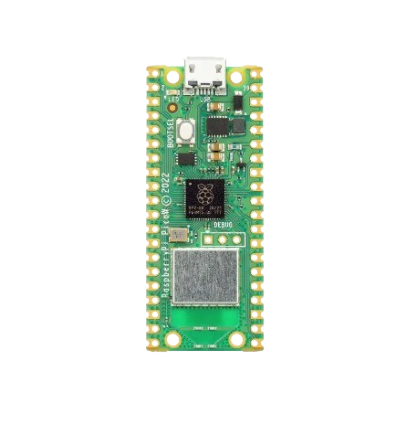

# IoTSenseLab

***Esse projeto de IoT usa uma Raspberry Pi Zero W conectada a sensores de ambiente, como temperatura e umidade, para monitorar dados em tempo real. Ele envia as informações via protocolo MQTT para o BitDogLab, onde conseguimos simular, analisar e visualizar o comportamento dos dados em uma rede de laboratório. A ideia é facilitar o monitoramento ambiental e explorar a conectividade IoT, integrando dispositivos físicos com um ambiente digital.***

-----------------------------------------------------------------------------------------------------------

*BitDogLab*

 - configurar "IP_DO_BROKER_BITDOGLAB" pelo endereço IP real do broker MQTT configurado no BitDogLab.

 - ao conectar o código envia os dados capturados em tempo real capturado do sensor DHT11/DHT22 que fica na **raspberry pi W** e envia esses dados para o broker MQTT configurado no BitDogLab.

 
 - MQTT (tópico) > configurar para garantir que os dados reais estão sendo recebidos.

-----------------------------------------------------------------------------------------------------------

*Raspberry Pi Zero W*

MIT License ©

